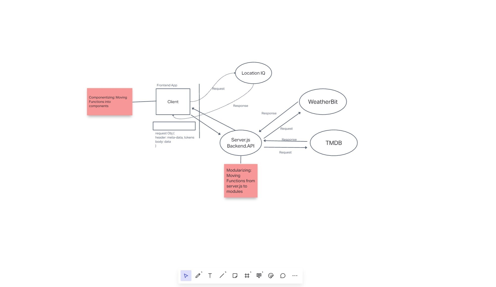

City-Explorer

**Author**: Adrienne Frey
**Version**: 1.0.0 

## Overview

## Getting Started

## Architecture

## Change Log

## Credit and Collaborations

Collaborated on some pieces with Jordan Covington
Received additional help and direction from TA's and my instructor, Audrey Patterson

Name of feature: Lab 7

Estimate of time needed to complete: 5 hrs

Start time: Tuesday 1/17 1:30pm-8:15pm

Finish time: 

Actual time needed to complete:

Name of feature: Lab 8

Estimate of time needed to complete: 5 hrs

Start time: 2:30pm

Finish time: 6:30pm the first day but finsihed during code review the following morning

Actual time needed to complete: 4-5hrs

Name of Lab: Lab 9

Estimate of time needed to complete: 1 hr

Start time: 1:30

Finish time: 3:30

Actual time needed to complete: 2 hr

